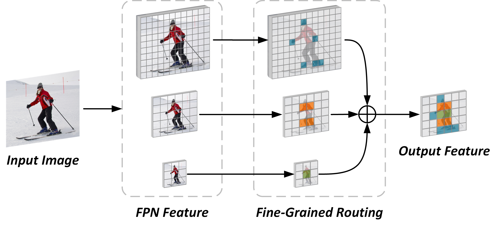

# Dynamic Head
By Lin Song, Yanwei Li, Zhengkai Jiang, Zeming Li, Hongbin Sun, Jian Sun, Nanning Zheng.

This repo is an official implementation for "[Fine-Grained Dynamic Head for Object Detection](https://proceedings.neurips.cc/paper/2020/file/7f6caf1f0ba788cd7953d817724c2b6e-Paper.pdf)" (NeurIPS2020) on PyTorch framework. 



## Installation
### Requirements
- Python >= 3.6
- PyTorch >= 1.6 and torchvision
- OpenCV, needed by demo and visualization
- pycocotools: 
	- `pip install cython`
	- `pip install 'git+https://github.com/cocodataset/cocoapi.git#subdirectory=PythonAPI'`
- prodict:
  - `pip install prodict`
- GCC >= 4.9

### Build from source
- `git clone https://github.com/StevenGrove/DynamicHead`
- `cd DynamicHead`
- `python setup.py build develop`
### Prepare data
See [datasets/README.md](datasets/README.md).

## Usage
All the projects are placed in  [cvpods_playground](cvpods_playground). You need to select a project and enter the corresponding folder.
```
# For example
cd cvpods_playground/fcos.res50.1x
```

### Training
```
# Running training procedure with specific GPU number
cvpods_train --gpu-nums <GPU_NUM> [optional arguments]

# Please refer to tools/train_net.py for more optional arguments
```

### Inference
```
# Running inference procedure with specific GPU number
# The program will load the lastest model weights from ./log folder
cvpods_test --gpu-nums <GPU_NUM> [optional arguments]

# Running inference procedure with specific GPU number and model path
cvpods_test --gpu-nums <GPU_NUM> MODEL.WEIGHTS <model_path> [optional arguments]

# Please refer to tools/test_net.py for more optional arguments
```

### Visualize your image [Optional]
```
# Please refer to demo/demo.py for more optional arguments
python ../../demo/demo.py --config <config_path> --input <input_path> --output <output_path> MODEL.WEIGHTS <model_path> [optional arguments]
```

## Performance

### Object Detection on COCO *val* set

All the results are based on ResNet-50 backbone. The FLOPs are calculated on the head only. "Low", "Mid" and "High" correspond to three configurations of different computational complex.

 Method | Depth | AP<sub>box</sub> (%) |  FLOPs<sub>avg</sub>  |  FLOPs<sub>min</sub>  |  FLOPs<sub>max</sub>  | Project | Model
:--|:--:|:--:|:--:|:--:|:--:|---|---
 FCOS | D2 | 38.7 | 98.0 | 98.0 | 98.0 | [Link](cvpods_playground/fcos.res50.1x) | [GoogleDrive](https://drive.google.com/file/d/1kEFincT--62oUj3Bu17VY75KpKg59W9u/view?usp=sharing) 
 FCOS+Fix | D4 | 40.1 | 198.6 | 198.6 | 198.6 | [Link](cvpods_playground/fcos.res50.1x.fix.d4) | [GoogleDrive](https://drive.google.com/file/d/1Ii173iIYmsjSTan5KFvNU4l8x0JxnWXW/view?usp=sharing) 
 FCOS+Fix | D8 | 39.3 | 397.2 | 397.2 | 397.2 | [Link](cvpods_playground/fcos.res50.1x.fix.d8) | [GoogleDrive](https://drive.google.com/file/d/12m05jYOdyV73e_FPs_pUFCsIlM7DvIxI/view?usp=sharing) 
 FCOS+Dynamic (Mid) | D4 | 40.7 | 52.2 | 12.1 | 144.4 | [Link](cvpods_playground/fcos.res50.1x.dynamic.d4.lambda-0_1) | [GoogleDrive](https://drive.google.com/file/d/1GJrkSgNgmbEnAae0AmhbxknODqAFJv__/view?usp=sharing) 
 FCOS+Dynamic (Low) | D8 | 40.2 | 33.3 | 6.4 | 140.2 | [Link](cvpods_playground/fcos.res50.1x.dynamic.d8.lambda-0_8) | [GoogleDrive](https://drive.google.com/file/d/1DY80O2Ww-HaaIz6SWaBTwL7OtXFcPvYX/view?usp=sharing) 
 FCOS+Dynamic (Mid) | D8 | 41.2 | 83.9 | 21.3 | 237.7 | [Link](cvpods_playground/fcos.res50.1x.dynamic.d8.lambda-0_1) | [GoogleDrive](https://drive.google.com/file/d/1K5vjCkqoHhqIsIeanfhrNU4MaBfbcWpi/view?usp=sharing) 
 FCOS+Dynamic (High) | D8 | 42.0 | 277.5 | 180.4 | 328.5 | [Link](cvpods_playground/fcos.res50.1x.dynamic.d8.lambda-0) | [GoogleDrive](https://drive.google.com/file/d/1AKrB7vb3R_xrg-8c7kyx6GYvOemO06-4/view?usp=sharing) 

### More Results is Coming


## To do
- [ ] Easier installation based on pip
- [ ] Fast implementation for masked convolution
- [ ] Application on two-stage object detectors

## Citation

Please cite the paper in your publications if it helps your research.

```
@inproceedings{song2020fine-grained,
    title = {Fine-Grained Dynamic Head for Object Detection},
    author = {Song, Lin and Li, Yanwei and Jiang, Zhengkai and Li, Zeming and Sun, Hongbin and Sun, Jian and Zheng, Nanning},
    booktitle = {Advances in Neural Information Processing Systems},
    year = {2020}
}
```

Please cite this project in your publications if it helps your research.
```
@misc{dynamichead,
    author = {Song, Lin},
    title = {DynamicHead},
    howpublished = {\url{https://github.com/StevenGrove/DynamicHead}},
    year ={2020}
}
```